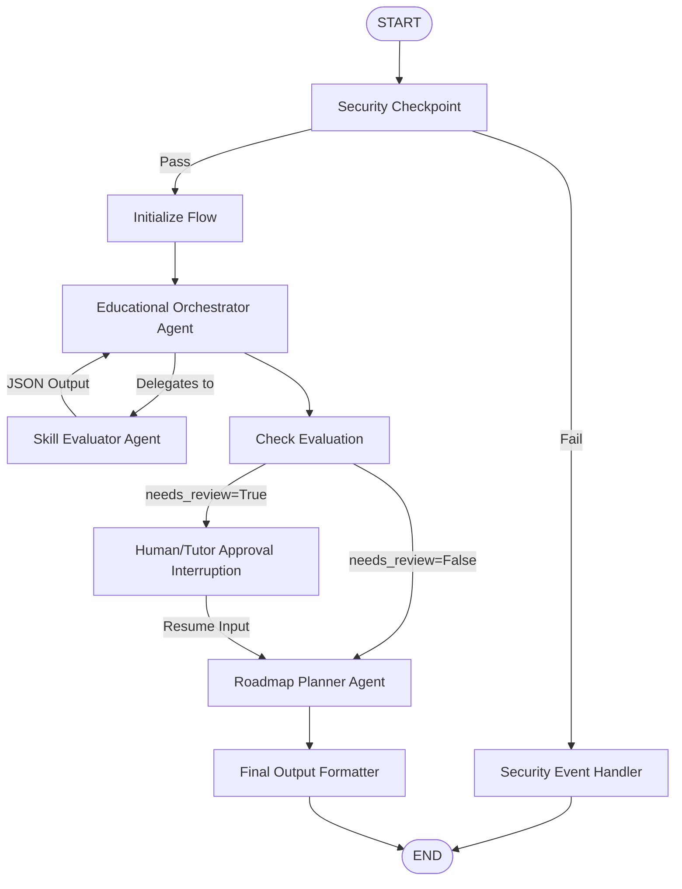

# 🎓 EduPath — Google ADK Hackathon Submission Write-Up

## 1. Project Overview & Pitch
**EduPath** is a personalized AI-powered learning roadmap generator built with the **Google Agent Development Kit (ADK)**. 

In a world where educational resources are abundant but unstructured, students are often overwhelmed by choice and lack clear directions. Traditional courses are rigid and fail to adapt to a student's personal constraints (like weekly availability), starting background, or specific goals. 

EduPath solves this by orchestrating a team of specialized AI agents to analyze a student's learning goals, evaluate their existing gaps, determine if expert/tutor intervention is needed, and design a custom, weekly milestone curriculum packed with resources—all while maintaining high safety standards.

---

## 2. Track & Theme: *Agents for Good*
EduPath is submitted under the **Agents for Good** track. It advances educational equity and accessibility by providing premium-grade, tutor-reviewed curriculum design for free to anyone, anywhere. By leveraging safety filters, human-in-the-loop check-ins, and dynamic scheduling, it creates safe and effective learning environments that scale.

---

## 3. Core Architecture
EduPath uses a declarative event-driven workflow graph constructed with Google ADK. Here is the visual breakdown of the architecture:

### Key Components:
- **`StudentProfile` (Input Schema)**: Collects `subject`, `experience_level`, `learning_goals`, and `available_hours_per_week`.
- **`security_checkpoint` (State Guardrail)**: Scrubs PII (emails/phones), flags prompt injection keywords, and blocks academic dishonesty (e.g. essay cheating, exam solving).
- **`skill_evaluator` (Specialist Agent)**: Analyzes goals, highlights gaps, and recommends focus areas. Flagged as needing review if goals are too vague or study time is low (< 5 hours/week).
- **`human_approval` (Human-in-the-Loop)**: Interrupts the workflow to allow a teacher or tutor to review and add custom notes before generating a curriculum.
- **`roadmap_planner` (Curriculum Agent)**: Computes study timelines and matches learning milestones to top educational resources using customized MCP tools.
- **`LearningRoadmap` (Output Schema)**: Emits a structured breakdown conforming to milestones, weeks, and tips.

---

## 4. MCP Tools & Services
We built a custom Model Context Protocol (MCP) server located in [mcp_server.py](file:///d:/adk%20workspace/edupath/app/mcp_server.py) providing three specialized capabilities:
1. **`search_courses`**: Fetches curated courses and resources from Coursera, Udemy, and edX based on student subject and milestone needs.
2. **`get_learning_tips`**: Generates cognitive learning strategies customized to the student's experience level (e.g. active learning for beginners, system design for advanced).
3. **`calculate_study_schedule`**: Mathematically computes weeks and hours needed based on subject difficulty and available weekly hours.

---

## 5. Security & Safety Design
EduPath implements a zero-trust safety design at the edge of the workflow:
- **PII Protection**: Regex matches and redacts email addresses and phone numbers to ensure student privacy.
- **Jailbreak Mitigation**: Detects prompt override keywords (e.g. "ignore previous instructions", "developer mode").
- **Academic Integrity**: Flags keywords like "cheat on test" or "write my essay" to prevent misuse of the tool for homework/exam fraud, cleanly terminating the execution with a user-friendly alert.

---

## 6. Business & Social Impact
- **Democratizing Education**: Allows learners who cannot afford private coaching to obtain personalized, high-quality curriculum planning.
- **Optimizing Teacher Workloads**: Human-in-the-loop review allows educators to quickly approve plans and add advice rather than spending hours drafting syllabi manually.
- **Adapting to Neurodiversity**: Tailors timelines dynamically to allow self-paced learning styles.

---

## 7. Future Horizons
- **Real-Time Web API Integration**: Integrate live courses and videos search via web search APIs.
- **Interactive Quiz Agents**: Add sub-agents that run simple knowledge tests after each weekly milestone is marked complete.
- **LMS Exports**: Enable exporting generated schedules directly to Google Calendar or Notion via OAuth.
